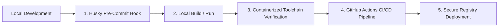
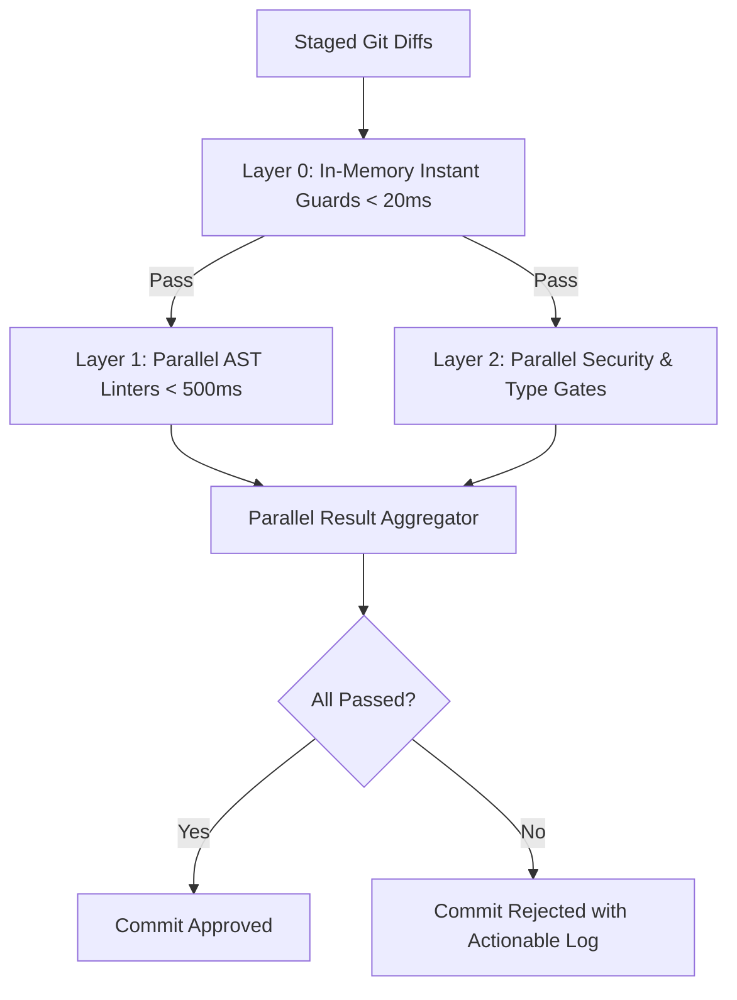

# 🔄 Secure Software Development Lifecycle (SSDLC) Blueprint

This document details the automated gates, static analysis checks, containerized toolchain, and CI/CD security rules that govern code quality, boundaries, and security across the SG Forge repository.

---

## 📋 SSDLC Architecture

SG Forge enforces security checks at every phase of the development lifecycle, from local changes to pull request merge:



---

## 🛠 1. Local Pre-Commit Quality & Security Gates (Google-Grade Standards)

To prevent security vulnerabilities, malicious unicode tricks, confidential credential leaks, syntax errors, or architectural degradation from reaching remote branches, the repository leverages a multi-layer pre-commit hook managed by **Husky** (`.husky/pre-commit` calling `toolchain/run-precommit.sh`).

### Root Cause Analysis & Security Defenses

Prior to the 2026 hardening audit, standard linters left critical blindspots in developer workflows:
1. **Trojan Source & Invisible Unicode Attacks (CVE-2021-42574)**: Attackers or compromised packages could introduce bidirectional unicode override characters (`\u202A-\u202E`, `\u2066-\u2069`) to change code execution order while displaying deceptive code to reviewers.
2. **Accidental Credential Staging**: Staging private keys (`*.pem`, `*.key`), SSH credentials (`id_rsa`), or un-templated `.env` secret files could leak sensitive information before external scanner tools executed.
3. **Monorepo Bloat & Cross-Platform Collisions**: Accidental staging of large SQLite database files or case-insensitive duplicate filenames could permanently corrupt git histories or break macOS/Windows/Linux cross-platform monorepo checkouts.

### Layered Pre-Commit Execution Model



### Verification Gate Matrix:

| Gate Layer | Verification Tool / Check | Scope & Target Files | Security & Hygiene Guarantee |
| :--- | :--- | :--- | :--- |
| **Layer 0 (Instant)** | **Sensitive File Blocklist** | All staged paths | Rejects `.env*`, `*.pem`, `*.key`, `id_rsa`, `*.sqlite`, `*.kdbx` immediately. |
| **Layer 0 (Instant)** | **Trojan Source Blocker** | All staged diffs | Scans for invisible unicode (Bidi `\u202A..\u2069`, `\u200B`) preventing CVE-2021-42574. |
| **Layer 0 (Instant)** | **Relative Import Enforcer** | `*.ts`, `*.tsx`, `*.js`, `*.jsx` | Enforces absolute module aliases (`@/...`), rejecting relative imports (`./`, `../`). |
| **Layer 0 (Instant)** | **Repo Bloat & Mode Guard** | All staged files | Rejects files > 1 MB and blocks unauthorized `chmod +x` executable bits on non-scripts. |
| **Layer 0 (Instant)** | **Case-Collision & MkDocs** | Staged paths & docs | Prevents case-insensitive filename clashes and verifies doc registration in `mkdocs.yml`. |
| **Layer 1 (Linter)** | **Biome** | `*.js`, `*.ts`, `*.json`, `*.css` | Sub-millisecond syntax verification, code formatting, and semantic linting. |
| **Layer 1 (Linter)** | **Ruff** | `*.py` | High-speed Python linting and formatting with `.ruff_cache` optimization. |
| **Layer 1 (Linter)** | **golangci-lint** | `*.go` | Concurrency safety checks, performance anti-patterns, and metalinter audit. |
| **Layer 1 (Linter)** | **SQLFluff** | `*.sql` | Enforces Postgres-compliant schema formatting and clean DDL rules. |
| **Layer 1 (Linter)** | **Dependency-Cruiser** | `core/`, `packages/`, `sandbox/` | Enforces unidirectional module boundaries (DAG) preventing circular dependencies. |
| **Layer 2 (Security)** | **Gitleaks** | Git staged diffs | Comprehensive entropy and pattern-based secret leak detection. |
| **Layer 2 (Security)** | **Semgrep (SAST)** | Staged source code | Static Application Security Testing for OWASP Top 10 vulnerabilities. |
| **Layer 2 (Security)** | **Trivy Supply-Chain** | `bun.lock`, `package.json` | Scans dependency tree for CVEs when lockfiles change. |
### Empirical Performance & Resource Benchmarks

Benchmarked on Linux x86_64 using GNU `time -v` (Maximum Resident Set Size & CPU Utilization):

| Workload Scenario | Staged Scope | Peak RAM (RSS) | CPU Consumption | Wall Clock Latency |
| :--- | :--- | :--- | :--- | :--- |
| **Clean Check / 0 Files** | 0 files | **4.9 MB** | < 1% CPU | `< 10 ms` |
| **Layer 0 Guards Only** | Diff inspection | **12.4 MB** | ~2% CPU | `< 25 ms` |
| **Standard Feature Commit** | 1–5 files (JS/TS/Py) | **28.5 MB – 39.6 MB** | Brief burst (< 5%) | `< 600 ms` (native) |
| **Full Initial Monorepo Commit** | 313 files (60k+ lines, all 10 tools) | **395 MB** | 86% across multi-core | `~50.9 s` (in container) |

---

## 🐳 2. Containerized Toolchain Platform

To eliminate the "works on my machine" class of bugs and guarantee absolute parity between local environments and CI/CD pipelines, all verification routines are containerized. 

The orchestrator script `./run.sh toolchain` runs tasks inside a controlled Docker environment (`toolchain/docker-compose.yml`):

### Available Verification Suites:
1. **Linter & Formatting Check**:
   ```bash
   ./run.sh toolchain lint
   ```
   Runs syntax checkers (Biome, Ruff, golangci-lint, SQLFluff, and Boundary checkers) across the entire monorepo.
   
2. **Security & Vulnerability Auditing**:
   ```bash
   ./run.sh toolchain security
   ```
   Scans the repository for hardcoded secrets, cryptographic keys, credentials leakages, and runs open-source vulnerability dependency audits (SAST).
   
3. **Automated Testing**:
   ```bash
   ./run.sh toolchain test
   ```
   Executes the frontend, backend, and integration tests with coverage mappings.
   
4. **Documentation Compilation**:
   ```bash
   ./run.sh toolchain docs
   ```
   Builds the architectural documentation site locally using MkDocs.

5. **Sequence Run**:
   ```bash
   ./run.sh toolchain all
   ```
   Sequentially executes linting, security scanning, test coverage, and documentation builds.

---

## 🔒 3. Architectural Boundary Controls

The repository implements strict package boundary separation using `dependency-cruiser` configured in `.dependency-cruiser.json`. This ensures:
*   **Sandbox Isolation**: Reference applications (Expenses, Python, Go) cannot directly import packages or classes from the Portal Core (`core/src`).
*   **Decoupled SDK Contracts**: The SDK packages (`packages/sdk`) are self-contained and compile independently of the server platform.
*   **Circular Import Prevention**: Enforces a strict directed acyclic graph (DAG) across components to prevent complex dependency loops.

---

## 🚀 4. CI/CD Integration (GitHub Actions)

Upon opening a Pull Request or pushing to main branches, GitHub Actions (`.github/workflows/ci.yml`) runs the same containerized toolchain tasks:
1. Builds the `toolchain` Docker container.
2. Runs the exact same commands `./run.sh toolchain all` verifying lints, security, tests, and docs.
3. Automatically blocks pull request merges if any pre-commit or security checks fail.

---

## 🛡 5. Static Analysis (SAST) & Secrets Bypass Policy

To maintain a secure development posture and prevent security regression, the following strict regulations govern the bypass or suppression of static security scan warnings:

### A. SAST (Semgrep) Suppressions (`// nosemgrep`)
*   **Input Validation Requirement**: Suppressing a SAST warning is strictly prohibited unless robust runtime sanitization (such as allowlisting, alphanumeric type checks, or regular expression matching) is implemented immediately before the affected statement.
*   **Rule Granularity**: Avoid using generic `// nosemgrep` comments that suppress all rules. Developers should specify the exact rule ID (e.g., `// nosemgrep: javascript.lang.security.audit.path-traversal.path-join-resolve-traversal`) where possible.
*   **Placement**: For multi-line statements, place the comment on the exact line flagged by Semgrep (typically the line containing the string interpolation or vulnerable variable lookup).
*   **Documentation**: Precede every suppression directive with a code comment explaining the safety context and referencing the mitigation logic.

### B. Secrets & Credential Leakage Suppressions
*   **No Hardcoded Secrets**: Under no circumstances should real secret credentials or API tokens be committed to Git, even with a bypass comment (like `# gitleaks:allow`).
*   **Config Isolation**: All secrets must be dynamically injected via environment variables (`process.env` or container env bindings) or sourced from verified configuration vaults.
*   **Allowed Exceptions**: False positives during local test suites using explicitly marked dummy test vectors (e.g., `authenticated_sunil_dev`) must be documented and scoped strictly to test files.
