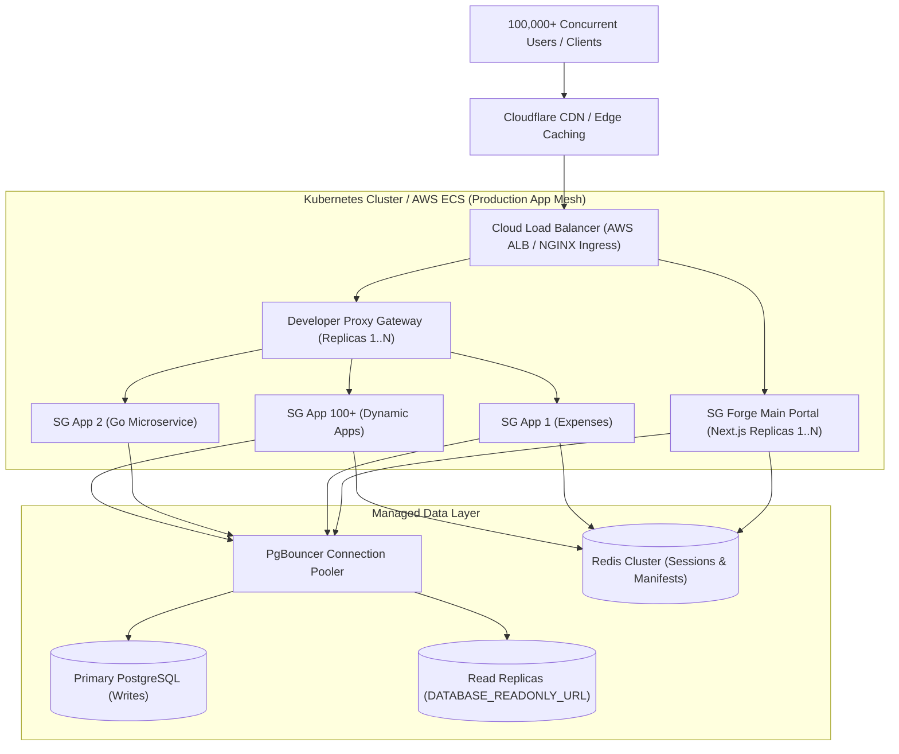

# Development vs. Realtime Production Architecture Guide

This reference guide details the architectural differences and scaling strategies between the **SG Forge Local Development Setup** and a **Real-World High-Traffic Production Deployment** hosting **100+ SG Forge Apps** (100,000+ concurrent users).

---

## 1. Executive Summary & Comparison

| Architecture Layer | Local Development (`./run.sh docker dev`) | Realtime Production Scale (100+ Apps / 100k+ Users) |
| :--- | :--- | :--- |
| **Execution Runtime** | Hot-reloading (`next dev`, `bun --watch`) | Pre-compiled standalone binaries (`next start`, compiled Go binaries) |
| **Orchestration** | Single-node Docker Compose (`docker-compose.yaml`) | Distributed Kubernetes (EKS/GKE) or AWS ECS with HPA |
| **App Instance Scaling** | Single instance container per app | **Horizontal Pod Autoscaling (HPA)**: 5–50 replicas per app |
| **Traffic Routing** | Direct host port bindings (`3001`, `3002`, `3003`) | **Ingress Controller** (NGINX / Envoy) + Cloudflare CDN |
| **Database Tier** | Single local PostgreSQL container (`sgforge-db-sanket`) | **Managed PostgreSQL** (AWS RDS / Cloud SQL) + Read Replicas + PgBouncer |
| **Session & Caching** | Local in-memory / single DB state | Distributed **Redis Cluster** for session state and app manifest caches |
| **Microservice Isolation** | Shared Docker bridge network (`sgforge-network`) | Network Policies, Service Mesh (Istio/Linkerd), and mTLS |
| **Storage & Logs** | Local named volumes & rotated log files (`10m`) | Centralized CloudWatch / Datadog / Grafana Loki log aggregation |

---

## 2. Real-World Architecture Blueprint (100+ SG Forge Apps)

When hosting 100+ micro-applications and reference apps on SG Forge, production scaling utilizes a 4-tier decoupled model:



---

## 3. Key Production Scaling Strategies

### A. Stateless App Tier & Horizontal Autoscaling (HPA)
- **Development**: Single `app` container processes all requests sequentially.
- **Production**: All 100+ SG Forge apps are built into immutable Docker images and deployed as stateless pods.
- **Kubernetes HPA** automatically scales container instances from 3 to 50 based on CPU (70% threshold) or HTTP request rate metrics:
  ```yaml
  apiVersion: autoscaling/v2
  kind: HorizontalPodAutoscaler
  metadata:
    name: sgforge-portal-hpa
  spec:
    scaleTargetRef:
      apiVersion: apps/v1
      kind: Deployment
      name: sgforge-portal
    minReplicas: 5
    maxReplicas: 50
    metrics:
      - type: Resource
        resource:
          name: cpu
          target:
            type: Utilization
            averageUtilization: 70
  ```

### B. Database Scaling with Read/Write Splitting
SG Forge code natively supports dual database connection strings:
- `DATABASE_URL`: Pointed to the **Primary Database Instance** for INSERT/UPDATE/DELETE queries.
- `DATABASE_READONLY_URL`: Pointed to a **PgBouncer Load Balancer** sitting in front of 3+ PostgreSQL **Read Replicas**.
- This offloads 90% of database queries (reads, analytics, manifest Lookups) away from the primary DB.

### C. CDN Edge Caching for Static Assets
- In development, Next.js compiles pages JIT on request.
- In production, Cloudflare or AWS CloudFront caches static assets (`/_next/static/*`, CSS, JS bundles, static media) at edge locations worldwide.
- **Impact**: 80,000+ of the 100,000 requests are served directly from edge caches with zero container CPU usage.

### D. Multi-Tenant Resource Isolation for 100+ Apps
To prevent a single app from starving the entire cluster:
1. **Memory & CPU Limits**: Every SG Forge app has strictly bounded resource quotas in Docker/K8s (e.g., 256MB RAM, 0.5 vCPU).
2. **Database Role Scoping**: Each app operates under its own isolated Postgres role and schema (`app_reference_expenses`, `app_reference_go`), enforcing hard multi-tenant isolation.
3. **Circuit Breakers & Timeouts**: Developer Proxy (`scripts/developer-proxy.ts`) implements 4-second request timeouts and fallback degraded statuses when dependent apps slow down.

---

## 4. Summary Checklist for Developers

When promoting an app from local development to production on SG Forge:

- [ ] Ensure app runs cleanly with `NODE_ENV=production` and pre-compiled assets.
- [ ] Confirm database queries use `DATABASE_READONLY_URL` for read operations.
- [ ] Implement standard `/api/health` endpoint for Kubernetes liveness/readiness probes.
- [ ] Set strict container RAM/CPU limits in application deployment manifests.
- [ ] Avoid relying on local container disk storage (use AWS S3 or persistent volume claims for file uploads).
